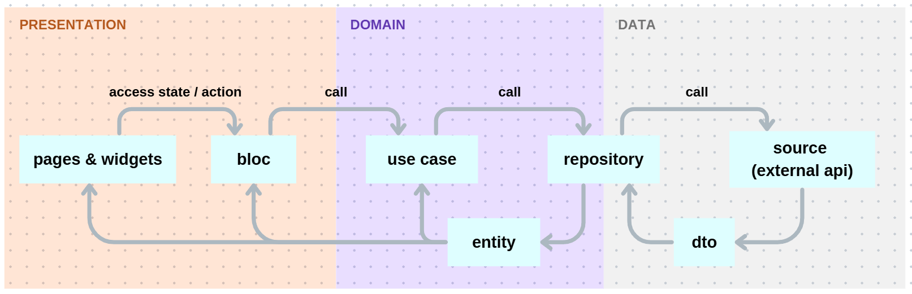

# Project Structure

Only the `assets` and `lib` trees are listed below.

```
assets/
  env/.env.dev
  env/.env.dist
  env/.env.prod
  env/.env.staging

lib/
  app.dart
  main_dev.dart
  main_prod.dart
  main_staging.dart
  core/
    config/
      env_loader.dart
      flavor.dart
      flavor_config.dart
    network/
      dio_provider.dart
    router/
      app_router.dart
  data/
    models/
      article_dto.dart
      article_dto.g.dart
    repositories/
      news_repository_impl.dart
    sources/
      news_api.dart
      news_api.g.dart
  di/
    injector.dart
  domain/
    entities/
      article.dart
    repositories/
      news_repository.dart
    usecases/
      get_top_headlines.dart
      toggle_bookmark.dart
  presentation/
    bloc/
      news_list_cubit.dart
      news_list_state.dart
    pages/
      news_detail_page.dart
      news_list_page.dart
    widgets/
      article_tile.dart
```

## Folder notes
- `assets/`: environment files for each flavor plus a shared template.
- `lib/app.dart`: root widget wiring app-level configuration.
- `lib/main_*.dart`: flavor-specific entrypoints (dev, staging, prod).
- `lib/core/`: cross-cutting concerns  
  - `config/`: flavor setup and environment loader.  
  - `network/`: Dio client/provider.  
  - `router/`: `GoRouter` configuration.
- `lib/data/`: data layer implementations  
  - `models/`: DTOs and generated serializers.  
  - `repositories/`: concrete repository using data sources.  
  - `sources/`: Retrofit API client and generated code.
- `lib/di/`: service locator setup via `injector.dart`.
- `lib/domain/`: business logic contracts and use cases  
  - `entities/`: core domain entities.  
  - `repositories/`: repository interfaces.  
  - `usecases/`: application-specific actions.
- `lib/presentation/`: UI layer  
  - `bloc/`: Cubit/state for news list.  
  - `pages/`: screens for list and detail.  
  - `widgets/`: reusable UI components.

## Architecture Example

### 1. `pres.pages` / `pres.widgets` call `pres.bloc` for state access / action.
```dart
class NewsListPage extends StatelessWidget {
  const NewsListPage({super.key});

  @override
  Widget build(BuildContext context) {
    return BlocProvider(
      create: (_) => injector<NewsListCubit>()..refresh(), // state action from bloc
      child: const _NewsListView(),
    );
  }
}
```

### 2 `pres.bloc` access actions from `domain.usecases`.

```dart
class NewsListCubit extends Cubit<NewsListState> {
  final GetTopHeadlines _getTopHeadlines; // usecase
  Future<void> _fetch({ // called by refresh() inside this cubit class, so we make it private (prefixed with _)
    required int page, 
    required bool append
  }) async {
    final result = await _getTopHeadlines( // action from usecase
      country: _country,
      page: page,
      pageSize: _pageSize,
    );
  }

  Future<void> refresh() async { // called by page / widget
    await _fetch(page: 1, append: false);
  }
}
```

### 3. `domain.usecases` call action from `domain.repositories` which implemented on `data.repositories` 
- `domain.repositories` = interface / abstract
- `data.repositories` = implementation
```dart
class GetTopHeadlines { // usecase
  final NewsRepository _repo; // repo

  GetTopHeadlines(this._repo); // parameter yang dikirim saat membuat objek akan otomatis di-assign ke field _repo

  Future<(List<Article> items, int totalResults)> call({ // Di dart, memberi nama call akan membuat sebuah objek bisa dipanggil seolah-olah itu fungsi
    required String country,
    required int page,
    required int pageSize,
  }) {
    return _repo.getTopHeadlines( // repo
      country: country,
      page: page,
      pageSize: pageSize,
    );
  }
}
```

```dart
// domain.repositories
abstract class NewsRepository { 
  Future<(List<Article> items, int totalResults)> getTopHeadlines({
    required String country,
    required int page,
    required int pageSize,
  });
}
```

### 4. `data.repositories` call `data.sources`, for example, an API.

```dart
// data.repositories
class NewsRepositoryImpl implements NewsRepository { 
  final NewsApi _api; // data.sources

  @override
  Future<(List<Article>, int)> getTopHeadlines({
    required String country,
    required int page,
    required int pageSize,
  }) async {
    final res = await _api.getTopHeadlines( // data.sources
      country: country,
      page: page,
      pageSize: pageSize,
    );
  }
}
```

```dart
// data.sources
import 'package:dio/dio.dart';
import 'package:flutter_news/data/models/article_dto.dart';
import 'package:retrofit/retrofit.dart';

part 'news_api.g.dart'; // using json_serializable

@RestApi() // retrofit feature
abstract class NewsApi {
  factory NewsApi(Dio dio, {String baseUrl}) = _NewsApi;

  @GET('/top-headlines')
  Future<TopHeadlinesResponseDto> getTopHeadlines({ // called by data.repositories, TopHeadlinesResponseDto is model defined in data.models
    @Query('country') required String country,
    @Query('page') required int page,
    @Query('pageSize') required int pageSize,
  });
}
```

### 5. Method in API (`data.sources`) is returning model type defined in `data.models`.
```dart
@JsonSerializable()
class TopHeadlinesResponseDto {
  final String? status;
  final int? totalResults;
  final List<ArticleDto>? articles;

  TopHeadlinesResponseDto({this.status, this.totalResults, this.articles});

  factory TopHeadlinesResponseDto.fromJson(Map<String, dynamic> json) =>
      _$TopHeadlinesResponseDtoFromJson(json);

  Map<String, dynamic> toJson() => _$TopHeadlinesResponseDtoToJson(this);
}
```

### 6. In `data.models`, we may need to provide `toEntity()` method to convert from Dtos to domain/entity model (`domain.entities`) which domain and presentation layer use.
```dart
@JsonSerializable()
class ArticleDto {
  final String? title;
  final String? description;
  final String? url;
  final String? urlToImage;
  final String? publishedAt;
  final SourceDto? source;

  ArticleDto({
    this.title,
    this.description,
    this.url,
    this.urlToImage,
    this.publishedAt,
    this.source,
  });

  factory ArticleDto.fromJson(Map<String, dynamic> json) =>
      _$ArticleDtoFromJson(json);

  Map<String, dynamic> toJson() => _$ArticleDtoToJson(this);

  Article toEntity({required bool isBookmarked}) { // to transform to entity Article, which is used by domain and presentation layer
    return Article(
      title: title ?? '-',
      description: description ?? '',
      url: url ?? '',
      imageUrl: urlToImage,
      publishedAt: publishedAt,
      sourceName: source?.name ?? '',
      isBookmarked: isBookmarked,
    );
  }
}
```

### 7. `data.sources` are registered using dependency injection (DI) on `di.injector.dart`, as well as dio, repository, use cases, bloc / cubit, etc.

```dart
// lib/di/injector.dart
final GetIt injector = GetIt.instance;

Future<void> setupInjector() async {
  injector.registerLazySingleton<Dio>(() => DioProvider.create());
  injector.registerLazySingleton<NewsApi>(() => NewsApi(injector<Dio>()));
  injector.registerLazySingleton<NewsRepository>(
    () => NewsRepositoryImpl(injector<NewsApi>()),
  );

  // use cases
  injector.registerLazySingleton(() => GetTopHeadlines(injector()));
  injector.registerLazySingleton(() => ToggleBookmark(injector()));

  // bloc
  injector.registerFactory(() => NewsListCubit(injector(), injector()));
}
```